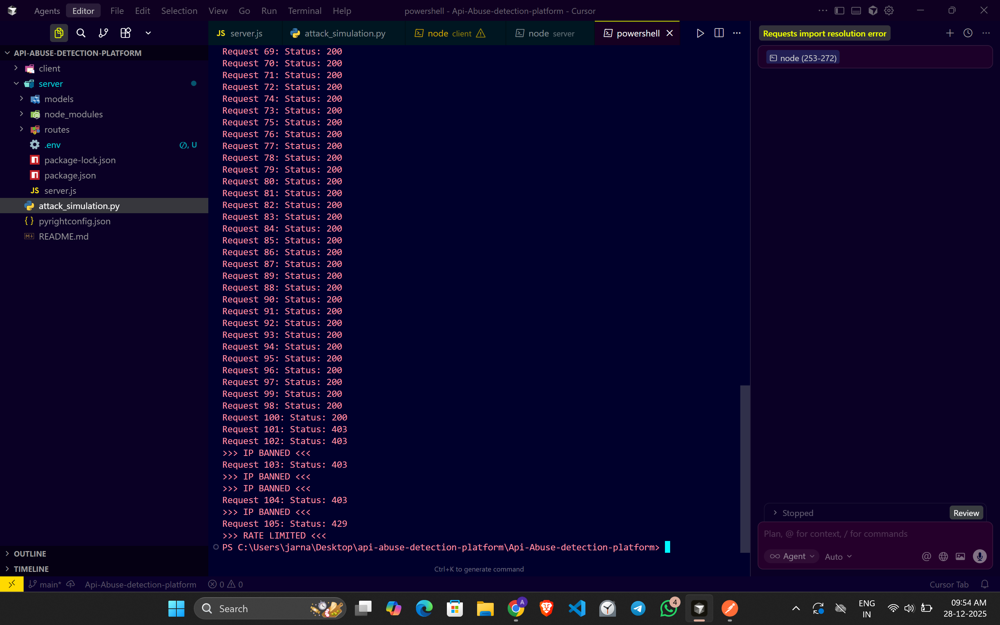
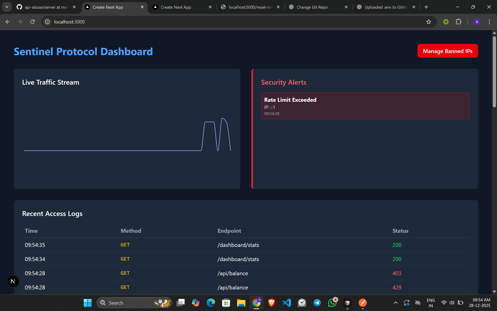
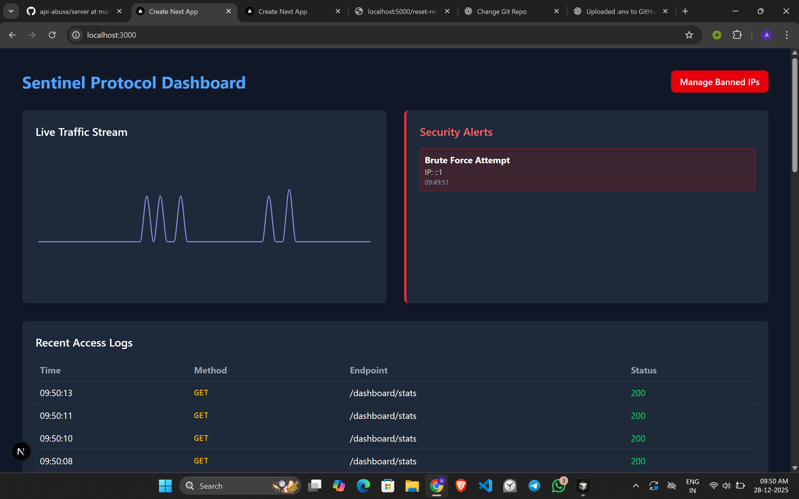
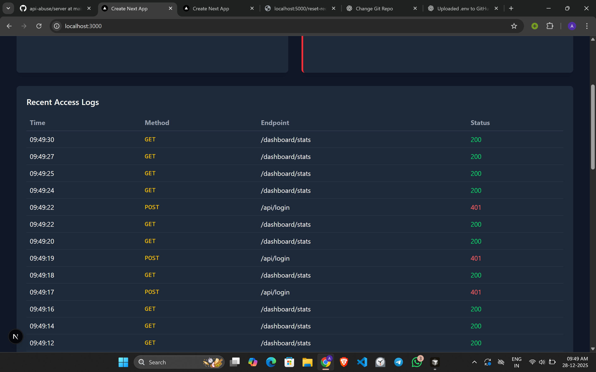
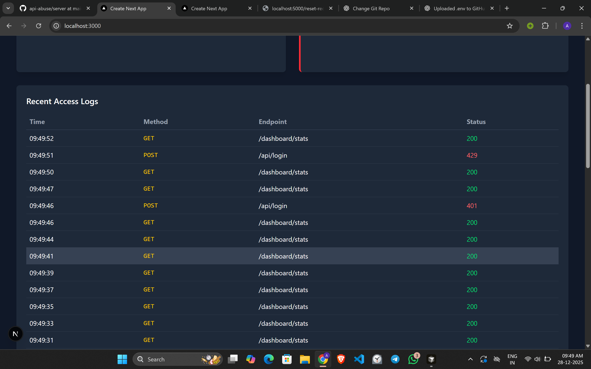
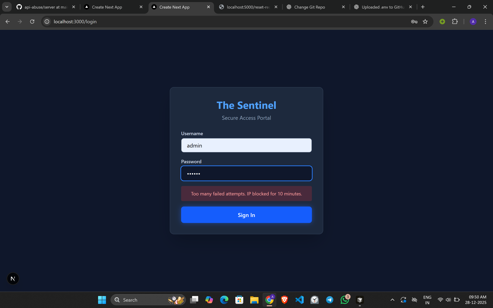
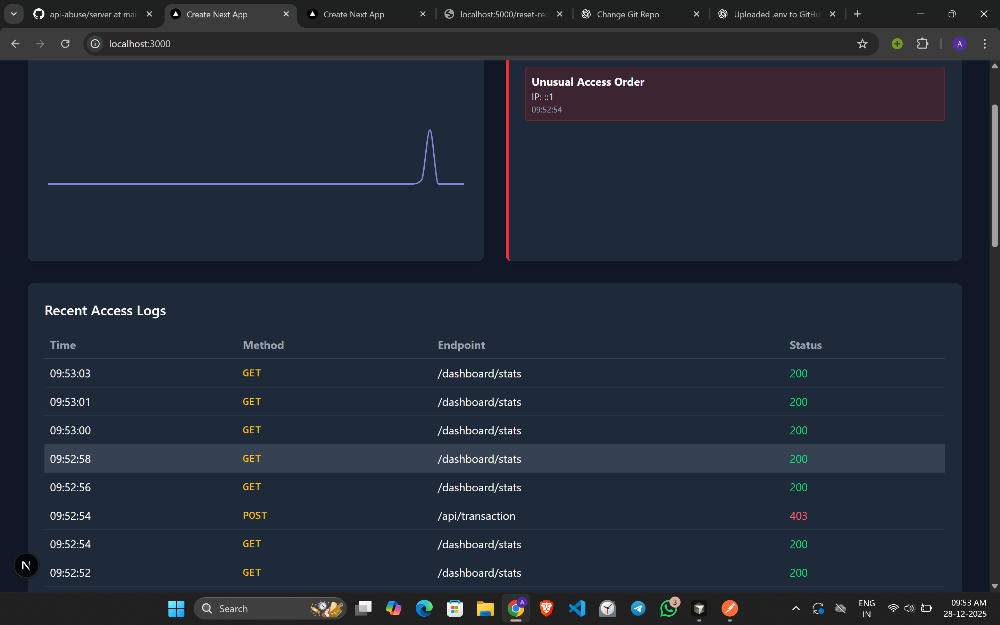
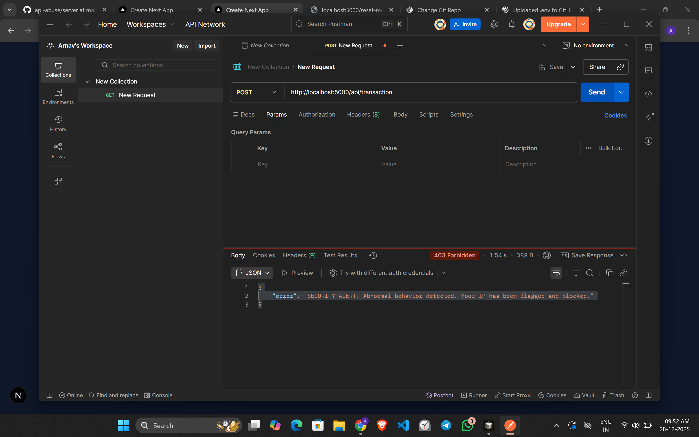
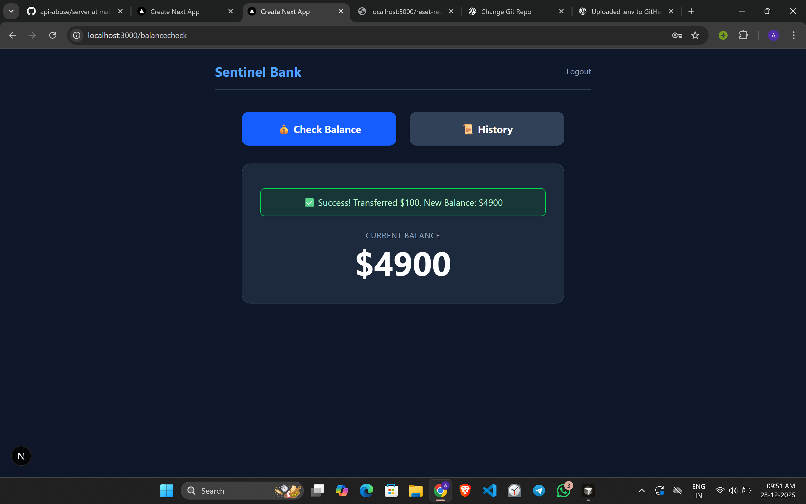
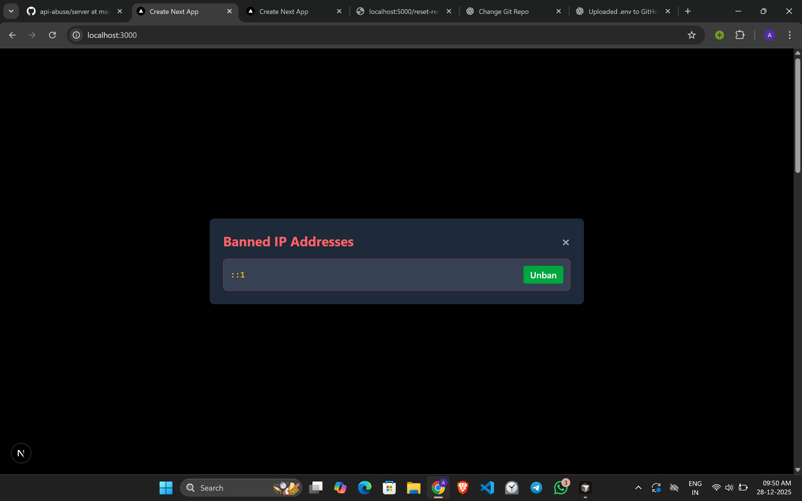

# 🛡️ The Sentinel Protocol
> **An Intelligent API Abuse Detection & Mitigation System**

## 📖 Problem Statement
In modern microservices and API-first architectures, **API Abuse** is a critical vulnerability that traditional firewalls often miss. Attackers exploit legitimate logic flows rather than just code vulnerabilities.

**The Sentinel Protocol** addresses three specific types of API abuse:
1.  **Brute Force Attacks:** Repeated login failures indicating credential stuffing.
2.  **Business Logic/Flow Violations:** Skipping prerequisite steps (e.g., attempting a transaction without checking balance).
3.  **High-Frequency Traffic:** Volumetric attacks (DDoS) from single sources.

---

## 🚀 Features

### 🔒 Security Core (The Sentinel Middleware)
* **Intelligent Rate Limiting:** Dynamic traffic shaping using Redis sliding windows.
* **Flow Validation:** Enforces mandatory request sequences (e.g., User *must* hit `/balance` before `/transaction`).
* **Brute Force Shield:** Automatically locks accounts and IPs after 5 failed login attempts.
* **Instant IP Banning:** Automatic and manual IP blacklisting with zero-latency lookups.

### 📊 Real-Time Dashboard
* **Live Traffic Stream:** Visualizes request statuses (200 OK vs 403 Forbidden) in real-time.
* **Security Alerts Feed:** Instant notifications for critical threats (Brute Force, Flow Violations).
* **Admin Controls:** One-click functionality to unban falsely flagged IPs.
* **Access Logs:** granular history of every request hitting the server.

---

## 🛠️ Tech Stack

### **Backend**
* **Node.js & Express:** High-performance REST API handling.
* **Redis:** In-memory key-value store for **sub-millisecond** rate limiting, session tracking, and ban management.
* **MongoDB:** Persistent storage for audit logs and security alert history.

### **Frontend**
* **React.js (Next.js):** Responsive, component-based UI.
* **Recharts:** For visualizing traffic data.
* **Tailwind CSS:** Modern, dark-mode focused styling.
* **Axios:** Efficient HTTP client for polling backend stats.

---

## 🧠 Approach & Architecture

The system uses a **Middleware-First Architecture**. Every request passes through a chain of "Sentinels" before reaching the business logic.

*(Conceptual visualization of request flow: Client -> Rate Limiter -> Ban Check -> Logic Validator -> Controller)*

1.  **Layer 1: The Gatekeeper (Redis Check)**
    * Checks if the IP exists in the `banned:` or `blocked:` Redis keys.
    * If yes, request is immediately rejected (403 Forbidden).

2.  **Layer 2: The Watchman (Rate Limiter)**
    * Increments a counter for the IP in Redis.
    * If requests > 100/min, temporary block is applied.

3.  **Layer 3: The Detective (Logic Flow)**
    * For sensitive endpoints (e.g., Transaction), checks for a specific "session token" set by previous prerequisite endpoints.
    * If the token is missing, it assumes a bot is skipping logic and bans the IP immediately.

---

## ⚙️ Installation & Setup

### Prerequisites
* Node.js (v16+)
* MongoDB (Local or Atlas URL)
* Redis (Local or Cloud URL)

# API Abuse Detection Platform (Sentinel Protocol)

A security-focused platform designed to detect and prevent common API abuse patterns such as DDoS attacks, brute-force login attempts, and business logic violations. The system provides real-time monitoring, automated blocking, and a live dashboard for visibility.

---

## 🚀 How to Run Locally

### 1️⃣ Start the Backend Server

Open a terminal in the `server` directory and run:

npm run dev
Expected output:

text
Copy code
✅ Redis Connected
✅ MongoDB Connected
🚀 Server running on http://localhost:5000
2️⃣ Start the Frontend Dashboard
Open a new terminal in the client directory and run:

npm run dev
Then open your browser and go to:
👉 http://localhost:3000

You should now see the Dashboard UI.

🛡️ Testing Security Scenarios (Attack Simulations)
Once the dashboard is running, you can test Sentinel Protocol’s defenses using the following scenarios.

🔴 Scenario 1: DDoS / High-Frequency Attack
The Attack:
An attacker floods the server with traffic (>100 requests/min).

How to Test:

Keep the Dashboard open and watch the Live Traffic graph.

Open a terminal and run the Python attack script:

python attack_simulation.py
Observation:

The traffic graph spikes sharply.

After ~100 requests, request status lines turn Red (403 / 429).

The attacking IP appears in the Banned IPs list on the dashboard.

🔐 Scenario 2: Brute Force Attack
The Attack:
An attacker repeatedly tries incorrect passwords to guess credentials.

How to Test:

Go to the Login Page in the frontend.

Enter a random username and an incorrect password 5 times.

Observation:

On the 6th attempt, you’ll see a
“Too many failed attempts” error.

A Brute Force Attempt alert appears in the Dashboard’s Security Alerts panel.

Your IP is temporarily banned.

⚠️ Scenario 3: Business Flow Violation (API Misuse)
The Attack:
An attacker bypasses logical checks (e.g., skipping balance verification) and directly triggers a transaction.

How to Test:

Open Postman (or a separate browser window).

Send a POST request directly to:

http://localhost:5000/api/transaction
⚠️ Do NOT call /api/balance first.

Observation:

The server responds with 403 Forbidden.

A Critical Alert (“Unusual Access Order”) appears instantly on the Dashboard.

The IP is permanently banned until manually unbanned by an admin.

🔄 Resetting for a New Test
If your IP gets banned during testing and you want to continue:

Open the Dashboard.

Click Manage Banned IPs.

Locate your IP (usually 127.0.0.1 or ::1).

Click Unban.

You can now rerun tests safely.

📊 Dashboard Features
Live traffic monitoring

Security alerts (DDoS, brute force, logic abuse)

Temporary & permanent IP banning

Manual unban controls

🧪 Recommended Tools
Node.js

MongoDB

Redis

Postman (for API testing)

Python (for attack simulations)

📌 Notes
Ensure MongoDB and Redis are running before starting the backend.

Run frontend and backend in separate terminals.

Testing is intended for local development only.